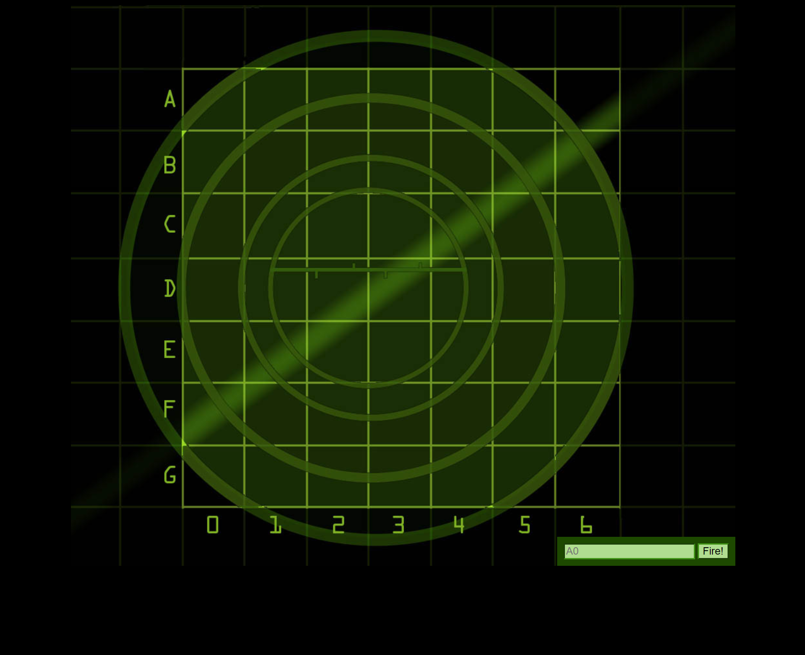

<h1 align="center"><b>
Battleship
</h1></b>

<h1 align="center">
    
</h1>

---

### 🥉 Observação

Peço desculpas em antecipado se algo "aparentar" um pouco confuso. Iniciei neste fantástico mundo da programação há poucas semanas, e estou aberto a feedbacks.

---

# 📝 About

Projeto / Jogo <b>"Batalha Naval"</b> desenvolvido conforme desafio do Livro [Head First! JavaScript](https://www.amazon.com.br/Head-First-JavaScript-Programming-Freeman/dp/144934013X/ref=tmm_pap_swatch_0?_encoding=UTF8&qid=1603229048&sr=8-1).

---

## 🚀 Tecnologias utilizadas

- [HTML5](https://developer.mozilla.org/en-US/docs/Web/Guide/HTML/HTML5)
- [CSS3](https://developer.mozilla.org/en-US/docs/Learn/CSS)
- [JavaScript](https://developer.mozilla.org/en-US/docs/Learn/javascript)

---

## 📁 Como baixar o projeto

```bash

    # Clonar o repositório
    $ git clone https://github.com/lrdplopes/battleshipthegame

    #Acessar o repositório
    $ cd battleshipthegame

    #Instalar suas dependências
    $yarn install

    #Iniciar o projeto
    $yarn start

```

---

Será um prazer conectar contigo através das minhas redes sociais:

✔ [LinkedIn](https://www.linkedin.com/in/lucas-pereira-969a2a190/) <br>
✔ [GitHub](https://github.com/lrdplopes) <br>
✔ [Twitter](https://twitter.com/LCmeducacional) <br>

---

⚫ Desenvolvido por Lucas Pereira.
